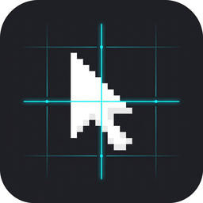

<div align="center">
  
  <h1>Seamless Cursor</h1>
  <p><strong>Never lose your mouse position in menus again.</strong></p>
  <p>Smooth, persistent mouse cursor positioning for Minecraft menus, container updates, and server chest GUIs.</p>

  <p>
    <a href="https://modrinth.com/mod/seamless-cursor"></a>
    <a href="https://curseforge.com/minecraft/mc-mods/seamless-cursor"></a>
    
    
    
    
  </p>
</div>

---

## 🎯 What is Seamless Cursor?

When playing on servers like **Hypixel** (SkyBlock, Bedwars, SkyWars) or using server menus, clicking through chest GUIs is often frustrating:
1. Every time a menu changes pages, updates items, or transitions to a sub-menu, vanilla Minecraft **snaps your mouse cursor back to the exact center of the screen**.
2. Worse, during the brief transition packet, your camera can jerk and your mouse hitches.

**Seamless Cursor fixes this completely.**

Your mouse stays **exactly where you left it** — right on the slot or button you were interacting with. Transitions feel completely instant, smooth, and natural, as if nothing closed at all.

---

## ✨ Features

- **No Center Snapping:** Your mouse cursor never resets to `(width / 2, height / 2)` during menu transitions or reopening.
- **Zero Mouse Hitching:** Eliminates the brief cursor stutter and background camera jitter when server plugins send `ContainerClose` followed by `OpenScreen`.
- **Pure Client-Side:** Requires **NO** server-side mod. Works on any multiplayer server.
- **Safe Bounds Clamping:** Safely clamps coordinates within window limits if window dimensions change.
- **Ultra Lightweight:** Zero external mod dependencies (doesn't even require Fabric API). Under 45 KB jar footprint!
- **Zero-Config:** Plug-and-play. Drop it into your mods folder and it works immediately.

---

## 🛡️ Is it Safe? (Anticheat & Server Rules)

### **Yes, 100% Ban Safe.**

- **Zero Network Packets:** Minecraft network protocol does **not** send mouse cursor X/Y coordinates to servers. Servers only receive slot click events when you manually click.
- **No Automation / No Macros:** Seamless Cursor **does not click for you**. All clicks are 100% manual.
- **Client-Side Cosmetic QoL:** Complies fully with Hypixel's *"Allowed Modifications - Aesthetic & GUI Improvements"* guidelines (similar to built-in cursor memory features in Badlion Client and Lunar Client).

---

## 🚀 Installation

1. Install **[Fabric Loader](https://fabricmc.net/)**.
2. Download `seamless-cursor-1.0.0.jar` from [Releases](https://github.com/MehmetCanWT/seamless-cursor/releases), [Modrinth](https://modrinth.com/mod/seamless-cursor), or [CurseForge](https://curseforge.com/minecraft/mc-mods/seamless-cursor).
3. Place the `.jar` into your `.minecraft/mods` folder.
4. Launch Minecraft and enjoy smooth menus!

---

## 🛠️ Building from Source

Requires **JDK 25**.

```bash
git clone https://github.com/MehmetCanWT/seamless-cursor.git
cd seamless-cursor
./gradlew :fabric-26.2:build
```

The compiled jar will be located at:
`fabric-26.2/build/libs/seamless-cursor-1.0.0.jar`

---

## 📄 License

This project is licensed under the [MIT License](LICENSE).
